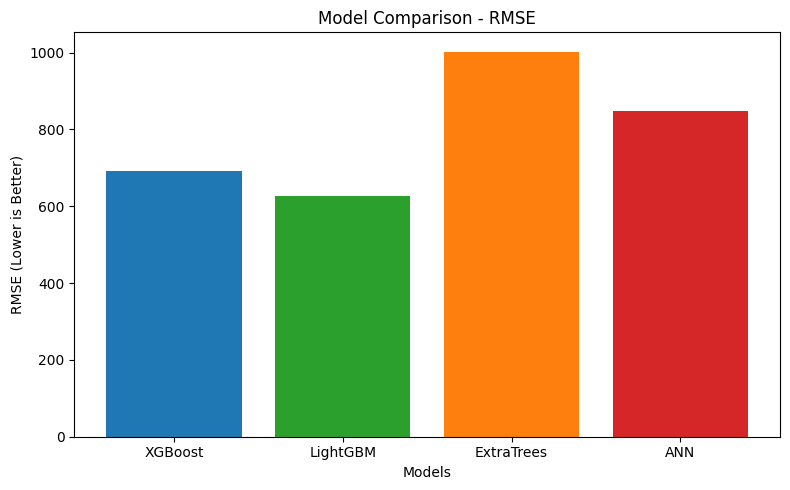
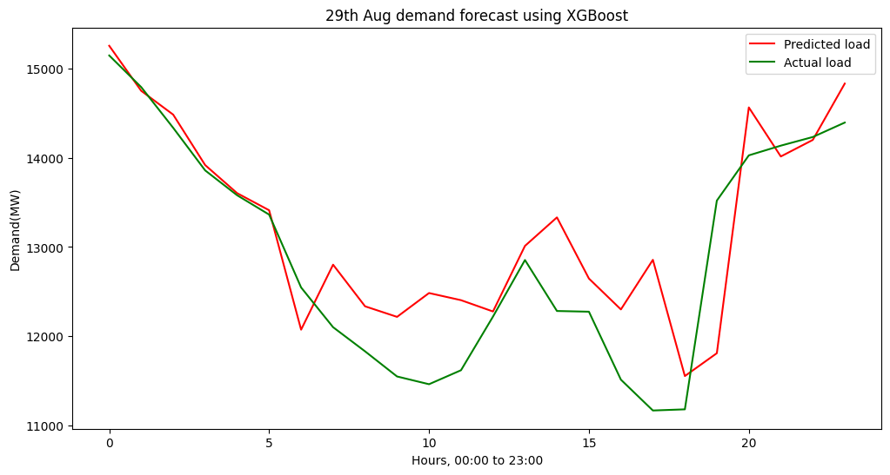
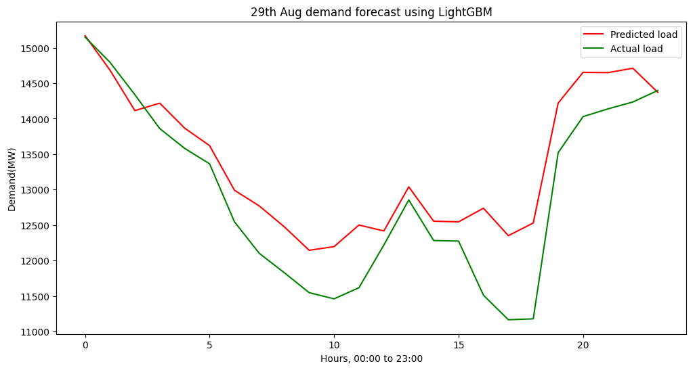
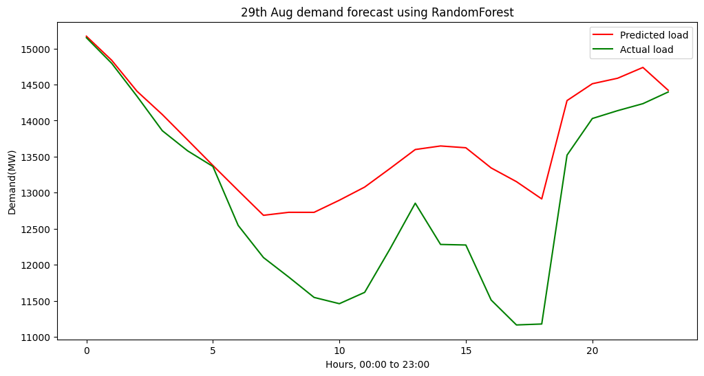
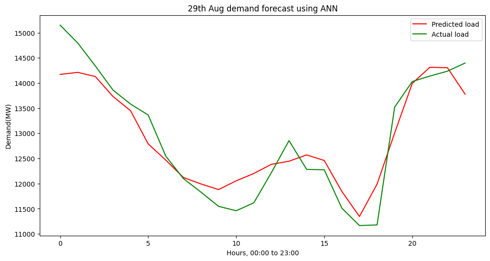

# ⚡ 24-Hour Power Demand Forecasting with Machine Learning Models  

This project applies **multiple regression-based machine learning models** to forecast short-term (next 24 hours) electricity demand for the Bangladesh Power Grid. The models are trained on real demand data from **[Power Grid Company of Bangladesh (PGCB)](https://erp.powergrid.gov.bd/w/generations/view_generations)** and evaluated based on prediction accuracy.  

---

## 🔍 Overview  
- Forecast horizon: **24 hours ahead** (single-day demand prediction).  
- Based on **hourly demand data** from PGCB.  
- Models compared:  
  - **XGBoost Regressor**  
  - **LightGBM Regressor**  
  - **ExtraTrees Regressor (Ensemble)**  
  - **Artificial Neural Network (ANN)**  
- Evaluation metric: **Root Mean Squared Error (RMSE)** to identify the best-performing model.  

---

## 🧹 Data Cleaning & Preprocessing  

The raw dataset contains timestamps and hourly demand values (`Demand(MW)`). Since the raw file is not fully clean, the following steps were applied:  

1. **Remove duplicates**  
   - Dropped any duplicate rows and duplicate timestamps.  

2. **Fix invalid dates**  
   - Parsed `Date` with a strict format (`%d-%m-%Y`), discarding invalid values.  

3. **Fix invalid times**  
   - The dataset contains times like `24:00:00` which are not supported by pandas.  
   - Converted `24:00:00` → `00:00:00` and incremented the date by one day.  
   - Padded missing leading zeros (e.g. `9:00:00` → `09:00:00`).  

4. **Create unified datetime index**  
   - Combined `Date + Time` into a single `dateTime` column.  
   - Set this as the index and resampled at **1-hour frequency**, which introduced missing slots where no data existed.  

5. **Outlier removal**  
   - Applied **IQR filtering**: values outside `[Q1 - 1.5*IQR, Q3 + 1.5*IQR]` replaced with `NaN`.  

6. **Missing value imputation**  
   - Interpolated missing and outlier-removed values using **time-based interpolation** to maintain continuity.  

---

## 📊 Results  

### Model Comparison (RMSE)  
| Model                  | RMSE   |
|-------------------------|--------|
| XGBoost Regressor       | **690.79** |
| LightGBM Regressor      | **625.94** |
| ExtraTrees Regressor    | **1002.57** |
| Artificial NN (ANN)     | **847.81** |

  
---

### Forecast Visualizations  

#### XGBoost (24h forecast)  
  

#### LightGBM (24h forecast)  
  

#### ExtraTrees (24h forecast)  
  

#### ANN (24h forecast)  
  

---

## ⚠️ Observations  

- **LightGBM** achieved the lowest RMSE (**625.94**), making it the best-performing model in this study.  
- **XGBoost** performed competitively, slightly higher RMSE than LightGBM.  
- **ExtraTrees** had the weakest performance, with higher RMSE due to more randomness in splits.  
- **ANN** performed moderately well but required longer training and careful tuning.  

---

## 🗂 Data Source  
Electricity demand data is sourced directly from the Power Grid Company of Bangladesh (PGCB):  
🔗 [https://erp.powergrid.gov.bd/w/generations/view_generations](https://erp.powergrid.gov.bd/w/generations/view_generations)  

---

## ✨ Future Improvements  
- Incorporate **exogenous features** such as temperature, holidays, and weekdays/weekends.  
- Explore **hybrid models** (e.g., combining boosting with ANN).  
- Extend to **multi-day forecasts** and compare with LSTM-based Seq2Seq models.  
- Deploy a **real-time forecasting API** with live PGCB data.  
